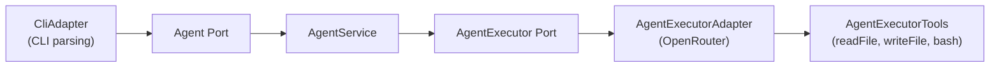

[](https://app.codecrafters.io/users/codecrafters-bot?r=2qF)

# coding-agent-effect

An AI coding assistant implementation in TypeScript, built with [Effect](https://effect.website) and [Bun](https://bun.sh) following hexagonal architecture. Created as a solution to the [CodeCrafters "Build Your Own Claude Code" challenge](https://codecrafters.io/challenges/claude-code).

## Supported Commands

| Command                 | Description                                                  |
| ----------------------- | ------------------------------------------------------------ |
| `assistant -p <prompt>` | Send a prompt to the coding assistant and receive a response |

### Tools Available to the Agent

| Tool        | Description                 |
| ----------- | --------------------------- |
| `readFile`  | Read the contents of a file |
| `writeFile` | Write content to a file     |
| `bash`      | Execute shell commands      |

## Getting Started

### Prerequisites

- [Bun](https://bun.sh) >= 1.3.10

### Setup

```sh
bun run setup
```

This installs dependencies and clones reference repos into `.repos/` for documentation and challenge stage descriptions.

### Running

```sh
./scripts/run.sh assistant -p "your prompt here"
```

Or equivalently:

```sh
bun run app/main.ts assistant -p "your prompt here"
```

### Environment Variables

| Variable              | Required | Description                                                  |
| --------------------- | -------- | ------------------------------------------------------------ |
| `OPENROUTER_API_KEY`  | Yes      | API key for OpenRouter                                       |
| `OPENROUTER_BASE_URL` | No       | Custom base URL (defaults to `https://openrouter.ai/api/v1`) |

## Architecture

The project follows a **hexagonal (ports-and-adapters)** architecture. The application core defines port interfaces and domain logic with no direct dependencies on I/O. Concrete adapters are wired together at the entry point using Effect layers.



### Layers

- **Ports** (`app/ports/`) — Interfaces defining the input and output boundaries of the application. `Agent` is the driving port (called by the CLI); `AgentExecutor` is driven by the service to interact with the LLM.
- **Adapters** (`app/adapters/`) — Concrete implementations: CLI argument parsing (`CliAdapter`), OpenRouter-backed agent executor with tool support, and provider configuration.
- **Application Service** (`app/application/services/agent.ts`) — `AgentService` implements the `Agent` port by orchestrating multi-turn conversations with the LLM through `AgentExecutor`, managing turn budgets, and streaming output events.
- **Domain** (`app/domain/`) — Pure models for agent runs, turn events, output types, and tagged error classes. No I/O dependencies.

### Entry Point

`app/main.ts` composes all layers and runs the CLI:

```typescript
const AppLayer = AgentService.pipe(
  Layer.provideMerge(AgentExecutorAdapter),
  Layer.provideMerge(BunServices.layer),
);

CliAdapter.pipe(
  Effect.provide(AppLayer),
  BunRuntime.runMain,
);
```

## Project Structure

```
app/
├── main.ts                              # Entry point, wires layers
├── ports/
│   ├── agent.ts                         # Driving port (application API)
│   └── agent-executor.ts               # LLM execution port
├── adapters/
│   ├── cli.ts                           # CLI command/flag parsing
│   ├── agent-executor.ts               # OpenRouter LLM adapter
│   └── services/
│       ├── agent-executor-tools.ts      # Tool definitions (readFile, writeFile, bash)
│       └── provider.ts                  # OpenRouter client configuration
├── application/
│   └── services/
│       └── agent.ts                     # AgentService (core use cases)
└── domain/
    ├── models/
    │   ├── agent-run.ts                 # Agent run input schema
    │   ├── agent-executor.ts            # Turn I/O and event types
    │   └── output.ts                    # User-facing stream output variants
    └── errors/
        ├── agent.ts                     # Agent-level error types
        └── agent-executor.ts            # Executor-level error types
```

## Tech Stack

| Concern       | Tool                                                                       |
| ------------- | -------------------------------------------------------------------------- |
| Runtime       | [Bun](https://bun.sh)                                                      |
| Language      | TypeScript (strict mode)                                                   |
| Core library  | [Effect](https://effect.website) (layers, services, schemas, CLI, streams) |
| LLM provider  | [OpenRouter](https://openrouter.ai) via `@effect/ai-openrouter`            |
| Linting       | [oxlint](https://oxc.rs)                                                   |
| Formatting    | [dprint](https://dprint.dev)                                               |
| Type checking | `tsc` (no emit)                                                            |

## Scripts

| Script                 | Description                                                |
| ---------------------- | ---------------------------------------------------------- |
| `bun run setup`        | Install dependencies and clone reference repos             |
| `bun run dev`          | Run the CLI (`bun run app/main.ts`)                        |
| `bun run clean`        | Remove `bun.lock`, `node_modules`, `.repos`, and `.cursor` |
| `bun run format:fix`   | Auto-format with dprint                                    |
| `bun run format:check` | Check formatting without modifying files                   |
| `bun run lint:check`   | Run oxlint and type checking                               |
| `bun run lint:fix`     | Auto-fix lint issues with oxlint                           |
